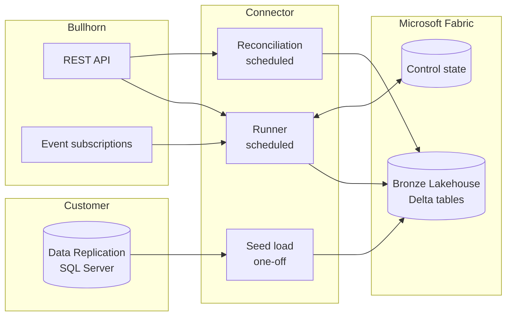

# ats-fabric-connector

**Status: Alpha. Not for production use. Testers wanted.**

Interfaces, table layouts and configuration may change between releases without notice. Read [Known limitations](#known-limitations) before you install.

`ats-fabric-connector` moves Bullhorn ATS/CRM data into a Microsoft Fabric Lakehouse as Delta tables. It is for any organisation using Bullhorn that is moving reporting, analytics or downstream integration onto a data lake in Microsoft Fabric.

It is derived from [ingestr](https://github.com/bruin-data/ingestr) by Bruin Data Limited. It adds a Bullhorn REST API source and a small toolkit for running a dependable, incremental feed into OneLake.

---

## Contents

1. [What it does](#what-it-does)
2. [Why an API-based feed](#why-an-api-based-feed)
3. [Architecture](#architecture)
4. [Testers wanted](#testers-wanted)
5. [Prerequisites](#prerequisites)
6. [Bullhorn usage responsibilities](#bullhorn-usage-responsibilities)
7. [Quick start](#quick-start)
8. [Configuration](#configuration)
9. [Tables delivered](#tables-delivered)
10. [How deletes are handled](#how-deletes-are-handled)
11. [API budget controls](#api-budget-controls)
12. [Data protection](#data-protection)
13. [Known limitations](#known-limitations)
14. [Roadmap](#roadmap)
15. [Contributing](#contributing)
16. [Security](#security)
17. [Licence](#licence)
18. [Trademarks and affiliation](#trademarks-and-affiliation)

---

## What it does

1. **Reads Bullhorn through the REST API.** The connector handles data centre discovery, OAuth with refresh token rotation, session reuse and Bullhorn's rate-limit responses.
2. **Writes Delta tables to OneLake.** Tables land in a Fabric Lakehouse and are immediately queryable from the SQL analytics endpoint, Spark and Power BI.
3. **Loads incrementally.** Each run reads only records changed since the last successful run, keyed on `dateLastModified`, and merges them on the record ID.
4. **Seeds without using the API.** The initial full load can come from an existing Bullhorn Data Replication database. This avoids spending the monthly API allowance on history.
5. **Captures deletes.** Deletes are recorded from soft-delete flags, Bullhorn event subscriptions and scheduled reconciliation.
6. **Reconciles.** Row counts and keys are compared between Bullhorn and the Lakehouse on a schedule, and the results are logged to a table.
7. **Protects the API allowance.** Calls are tracked per run and per month. Non-critical entities are skipped before the allowance is breached.

---

## Why an API-based feed

Many organisations take Bullhorn data through Bullhorn Data Replication, which copies Bullhorn into a customer-hosted SQL Server database. Two issues arise when that database becomes the route into Fabric.

1. **Bullhorn's intended use.** Bullhorn describes Data Replication as a source for business intelligence and reporting. It advises against using it as a source for payroll, billing or similar systems, and lists API-based integration as the supported route for those uses. See [Understanding Bullhorn Data Replication](https://kb.bullhorn.com/ats/Content/BHATS/Topics/understandingDataMirror.htm).
2. **Mirroring contention.** Fabric database mirroring reads the SQL Server transaction log to build its change feed. On a replication database that Bullhorn is continuously updating, this can contend with the replication process, particularly during the initial snapshot.

This project takes a hybrid approach. The replication database seeds the history once, and the Bullhorn REST API carries ongoing change directly into Fabric.

---

## Architecture



| Component | Purpose | Frequency |
|---|---|---|
| Seed load | Loads history from Data Replication using mapped SQL queries | Once per entity, and on reseed |
| Runner | Computes the change window for each entity, reads the API and writes to OneLake | Scheduled |
| Reconciliation | Compares counts and keys between Bullhorn and the Lakehouse | Scheduled |
| Control state | Holds watermarks, subscription positions and API call totals | Updated each run |

Organisations without Data Replication can seed through the API instead. See [API budget controls](#api-budget-controls) for the cost of doing so.

---

## Testers wanted

The project is looking for organisations willing to test the alpha against a Bullhorn sandbox or a non-production Fabric workspace.

**Who is sought.** Organisations with the following:

1. Bullhorn API access.
2. A Microsoft Fabric capacity.
3. An interest in moving Bullhorn data into a Fabric data lake.

Experience with Bullhorn Data Replication is useful but not required.

**What testing involves.**

1. Installing the connector and running the seed, incremental and reconciliation steps.
2. Following the checks in [`fabric/verification/RUNBOOK.md`](fabric/verification/RUNBOOK.md).
3. Reporting results through the **Tester report** issue template.

**What to report.** Aggregates only: row counts, column names and types, run durations, API call counts, error codes and the steps that led to a problem.

**What never to report.** Bullhorn record data, credentials, tokens, corporation identifiers, tenant URLs, or screenshots that show records. Issues containing any of these will be removed.

To register interest, open an issue using the **Tester report** template and select "Registering interest".

---

## Prerequisites

| Requirement | Notes |
|---|---|
| Bullhorn edition with API access | The ATS Growth edition (formerly Team Edition) does not include API access for custom integrations. See [API Usage Limits](https://kb.bullhorn.com/ats/Content/BHATS/Topics/understandingBHAPIUsageLimitsVersioningBackwardCompatibility.htm). |
| OAuth client ID with refresh tokens enabled | Request this from Bullhorn Support. See [Get Started with the Bullhorn REST API](https://bullhorn.github.io/Getting-Started-with-REST/). |
| Dedicated Bullhorn API user | Used only by this connector. The user must accept the Bullhorn Terms of Service once, manually, before first use. |
| Microsoft Fabric workspace and Lakehouse | A non-production workspace is recommended for testing. |
| Microsoft Entra identity | A managed identity or service principal with Contributor access to the workspace. |
| Build tooling | Go (version as declared in `go.mod`), `make`, and Docker if you are building the container. |
| Bullhorn Data Replication (optional) | Required only if you are seeding from the replication database. |

---

## Bullhorn usage responsibilities

Every organisation using this connector is responsible for its own compliance with the [Bullhorn API Fair Use Policy](https://bullhorn.github.io/api-fair-use-policy/) and its agreement with Bullhorn.

At the time of writing, Bullhorn publishes the following limits in its [API Usage Limits](https://kb.bullhorn.com/ats/Content/BHATS/Topics/understandingBHAPIUsageLimitsVersioningBackwardCompatibility.htm) article. Check that article for current values, and check your own agreement with Bullhorn, which may differ.

| Limit | Published default |
|---|---|
| API calls per month | 100,000, unless otherwise agreed with Bullhorn |
| Requests per minute | 1,500, shared by all integrations using the same OAuth client ID |
| Concurrent sessions | 50 |
| Active event subscriptions | 50, with unused subscriptions and unretrieved events expiring after 30 days |

**Points to note.**

1. **The per-minute limit is shared.** If other integrations use the same OAuth client ID, set this connector's rate limit to its allocated share, not the full limit.
2. **Transfer only what you need.** The Fair Use Policy restricts transferring more data than the permitted purpose requires. The connector enforces explicit field allowlists for this reason.
3. **No AI or LLM tools.** The Fair Use Policy prohibits connecting the API to third-party AI or LLM tools without Bullhorn's explicit written permission. Do not connect this connector, or its outputs, to such tools on that basis without that permission.

---

## Quick start

The commands below reflect the current alpha and may change.

### 1. Build

```bash
git clone https://github.com/neilmanfredit/ats-fabric-connector.git
cd ats-fabric-connector
export INGESTR_DISABLE_TELEMETRY=true DISABLE_TELEMETRY=true
make build
git config core.hooksPath fabric/githooks   # contributors only
```

### 2. Configure

```bash
cp fabric/runner/entities.example.yaml fabric/runner/entities.yaml
```

Edit `entities.yaml` to set the entities, field allowlists and schedule groups you need. Keep credentials in a secret store or environment variables, never in this file.

### 3. Seed from Data Replication (optional)

Review the mapping queries in `fabric/seed/mappings/` with your database administrator, then run the seed outside peak hours:

```bash
fabric/seed/run-seed.sh --entity placement
```

The seed records a starting watermark for each entity it loads.

### 4. Run the first incremental

```bash
go run ./fabric/runner --config fabric/runner/entities.yaml
```

### 5. Reconcile

```bash
go run ./fabric/reconcile --config fabric/runner/entities.yaml --mode counts
```

Check `Tables/bullhorn/reconciliation_log` in your Lakehouse for the results.

### Using the source directly

The Bullhorn source can also be used as a standard ingestr source:

```bash
bin/ingestr ingest \
  --source-uri "bullhorn://?client_id=...&client_secret=...&refresh_token=...&username=...&data_center=...&rate_limit=...&token_output=..." \
  --source-table "placement" \
  --dest-uri "onelake://<workspace>/<lakehouse>?use_azure_default_credential=true" \
  --dest-table "Tables/bullhorn/placement" \
  --incremental-strategy merge \
  --interval-start "2026-01-01T00:00:00Z"
```

---

## Configuration

### Source URI parameters

| Parameter | Required | Description |
|---|---|---|
| `client_id` | Yes | Bullhorn OAuth client ID |
| `client_secret` | Yes | Bullhorn OAuth client secret |
| `refresh_token` | One of | Existing refresh token. Bullhorn issues a new refresh token on every refresh and invalidates the previous one. |
| `username`, `password` | One of | Used for the initial authorisation code flow only, when no refresh token is held |
| `data_center` | Yes | Validated against Bullhorn's `loginInfo` response for the API user |
| `rate_limit` | Yes | Requests per second. There is no default. Set it to no more than 80 per cent of the share of the per-minute limit allocated to this connector. |
| `token_output` | Yes | Path to which each rotated refresh token is written, with owner-only permissions |

### Runner settings

| Setting | Description |
|---|---|
| `entities` | Entity list with endpoint type, field allowlist, primary key, strategy, schedule group and critical flag |
| `overlap` | Window subtracted from each watermark to allow for clock skew and late-arriving changes |
| `budget.monthly_allowance` | Monthly API call allowance agreed with Bullhorn |
| `budget.threshold` | Share of the allowance at which non-critical entities are skipped |
| `secret_store` | `file` or `azure_key_vault`, used for persisting rotated refresh tokens |
| `state_path` | Location of the control state in the Lakehouse, by default `Files/control/bullhorn_state.json` |

See [`docs/supported-sources/bullhorn.md`](docs/supported-sources/bullhorn.md) for what each table holds, and [`fabric/runner/entities.example.yaml`](fabric/runner/entities.example.yaml) for a complete worked configuration.

---

## Tables delivered

Default tables are written under `Tables/bullhorn/` in the target Lakehouse.

| Table | Bullhorn entity | Key | Load pattern |
|---|---|---|---|
| `candidate` | Candidate | `id` | Incremental merge |
| `client_corporation` | ClientCorporation | `id` | Incremental merge |
| `client_contact` | ClientContact | `id` | Incremental merge |
| `job_order` | JobOrder | `id` | Incremental merge |
| `placement` | Placement | `id` | Incremental merge |
| `job_submission` | JobSubmission | `id` | Incremental merge |
| `corporate_user` | CorporateUser | `id` | Incremental merge |
| `entity_metadata` | Field metadata | `entity`, `field_name` | Full replace |
| `deleted_records` | Deletes from all sources | `entity`, `entity_id`, `event_id` | Incremental merge |
| `reconciliation_log` | Reconciliation results | Run and entity | Append |

1. **Adding entities.** Further entities can be added through configuration without code changes.
2. **Column typing.** Only `id`, `dateLastModified` and `isDeleted` are typed columns. Nested objects and associations are kept as JSON columns.
3. **Timestamps.** Bullhorn returns timestamps as epoch milliseconds. They are stored as microsecond-precision Delta timestamps.
4. **Associations.** Bullhorn returns only a limited number of records for to-many associations. Load associated entities as their own tables rather than relying on the nested values.

---

## How deletes are handled

Bronze tables are never pruned. Deletes are recorded separately so that downstream layers can apply them in a controlled and auditable way.

| Delete type | Source |
|---|---|
| Soft delete | The `isDeleted` flag arrives through normal incrementals, and a row is also written to `deleted_records` |
| Hard delete | `DELETED` events from Bullhorn event subscriptions |
| Missed or historical deletes | Scheduled key reconciliation |

Applying deletes to Silver or Gold layers is the responsibility of each organisation's downstream processing.

---

## API budget controls

1. **Tracking.** The runner records calls per entity per run and keeps a month-to-date total in the control state.
2. **Protection.** Before each run, the runner projects month-end usage. Above the configured threshold, it skips entities not marked critical and exits with a warning code for your scheduler to alert on.
3. **Budget model.** `fabric/REPORT.md` explains how to estimate calls per run, per month and per reconciliation from your change volumes.

**Seeding through the API.** A full API seed costs roughly one call per page of records for each entity. Estimate it before you start. For large Bullhorn databases, a seed can consume a significant share of the default monthly allowance.

---

## Data protection

Bullhorn data includes personal data about candidates, contacts and users.

1. **Field allowlists.** Every entity read uses an explicit field allowlist, and wildcard selection is not supported. The example configuration excludes national identifiers and other special category fields. Include them only with your data owner's approval.
2. **Logging.** Logs contain entity names, counts, durations, call volumes and error codes only. Record content is never logged.
3. **Secrets.** Refresh tokens are written only to the configured secret store or token path, and are never logged.
4. **Local-only files.** The repository ignores and blocks commits of environment files, tokens, keys, runtime state and verification results. See `.gitignore` and `fabric/scripts/check-sensitive-files.sh`.
5. **Your obligations.** Each organisation remains the controller of its Bullhorn data. It is responsible for access controls, retention and masking in its own Fabric workspace.

---

## Known limitations

1. The project is alpha software, tested against mocked Bullhorn responses and a limited number of sandbox tenants.
2. The Lucene and JPQL date range formats and bound inclusivity are still being confirmed across tenants.
3. Maximum page depth varies by endpoint. Very large entities may require date-window paging, which is still being validated.
4. Pay and bill entities are not in the default table set. Entity names and effective-dating behaviour are still being confirmed.
5. The OneLake destination does not apply deletes during merge, which is why deletes are recorded in `deleted_records` instead.
6. Only one runner may operate per Bullhorn API user, because refresh tokens are single-use.
7. Only Bullhorn is supported at present.

---

## Roadmap

The following items are under consideration and depend on tester feedback. None is committed.

1. Pay and bill entity coverage.
2. Date-window paging for very large entities.
3. A Fabric notebook deployment option alongside the container job.
4. Example Silver-layer transformations for applying deletes.
5. Support for other ATS platforms, subject to demand and each vendor's API terms.

---

## Contributing

Contributions are welcome through pull requests. Read [`CONTRIBUTING.md`](CONTRIBUTING.md) before opening one. It covers four areas.

1. **Commit messages.** Commit messages and pull request text must be plain and descriptive, with no tool-generated attribution trailers. CI rejects pull requests that contain them.
2. **Data and secrets.** Never include Bullhorn data, credentials or tenant details in code, tests, fixtures, issues or pull requests. Test fixtures must be built from the examples in Bullhorn's public [REST API documentation](https://bullhorn.github.io/rest-api-docs/).
3. **Checks.** Run `make format`, `make lint` and `make test` before submitting.
4. **Scope.** Changes to the shared upstream packages should be discussed in an issue first.

---

## Security

Report vulnerabilities privately through GitHub's private vulnerability reporting, as described in [`SECURITY.md`](SECURITY.md). Do not open public issues for security matters.

---

## Licence

This project is a derivative of ingestr and is distributed under the same licence: the [Functional Source License, Version 1.1, ALv2 Future License](LICENSE) (FSL-1.1-ALv2).

1. **Permitted uses.** The licence permits internal use, non-commercial education and research, and professional services provided to a licensee.
2. **Competing use.** It does not permit making the software available to others in a commercial product or service that substitutes for ingestr or offers substantially similar functionality. Offering this project as a paid or hosted ingestion service is therefore not permitted.
3. **Future licence.** Each upstream ingestr version becomes available under the Apache License 2.0 on the second anniversary of its release, as set out in the licence.
4. **Notices.** Original ingestr copyright notices are retained. Modifications are described in [`NOTICE`](NOTICE).
5. **Third-party components.** Third-party dependency licences are listed in [`THIRD_PARTY_LICENSES.txt`](THIRD_PARTY_LICENSES.txt).

---

## Trademarks and affiliation

Bullhorn is a trademark of Bullhorn, Inc. ingestr is a product of Bruin Data Limited. Microsoft, Microsoft Fabric and OneLake are trademarks of Microsoft Corporation.

This project is independent. It is not affiliated with, endorsed by or supported by Bullhorn, Inc., Bruin Data Limited or Microsoft Corporation. Product names are used only to describe compatibility and to identify the origin of the software.
